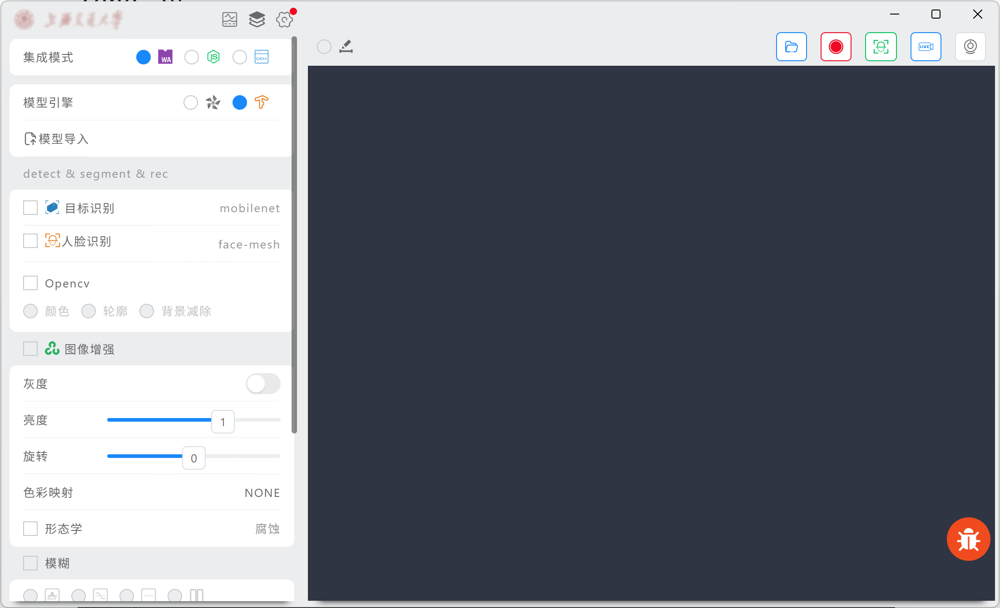
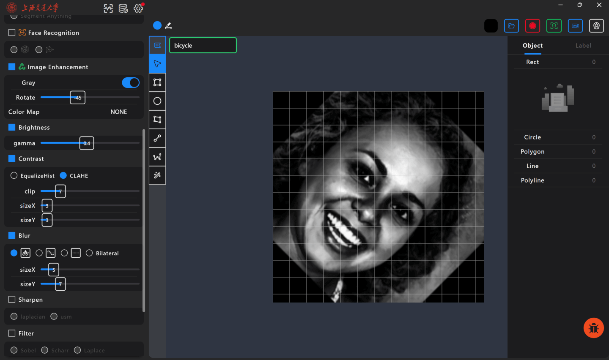
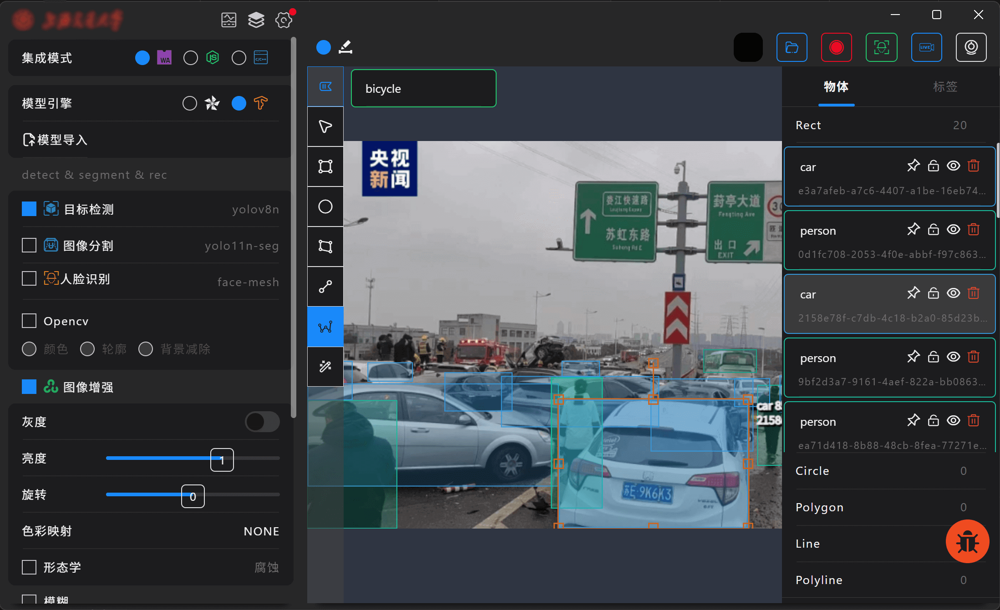
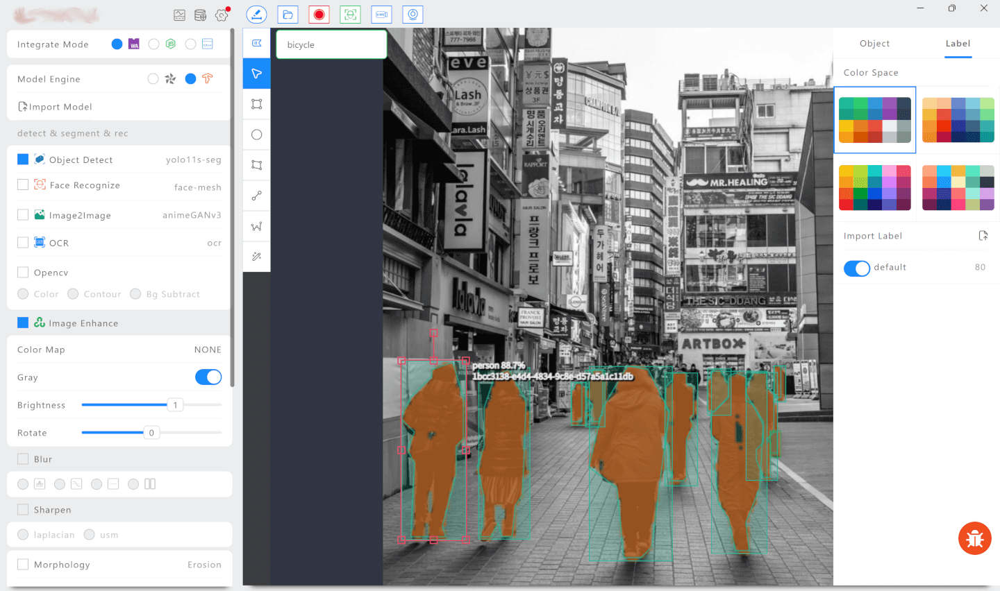
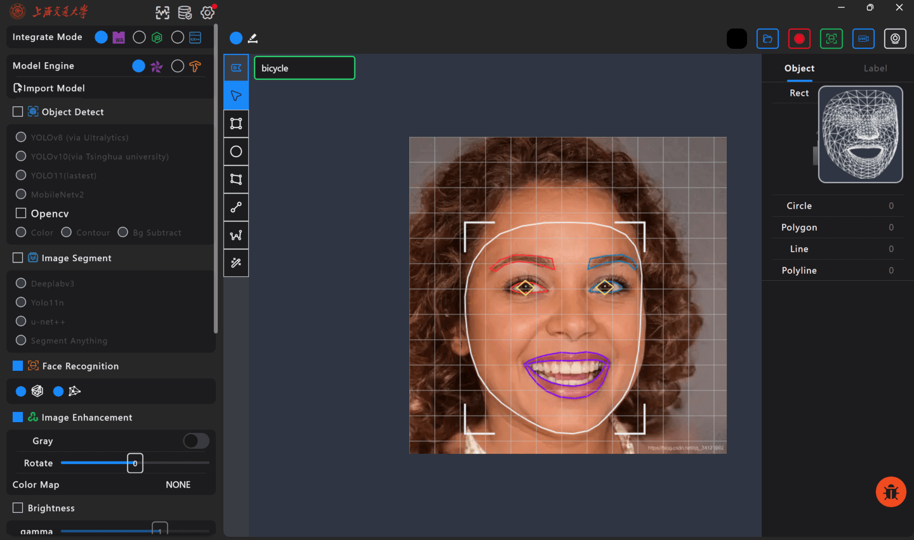
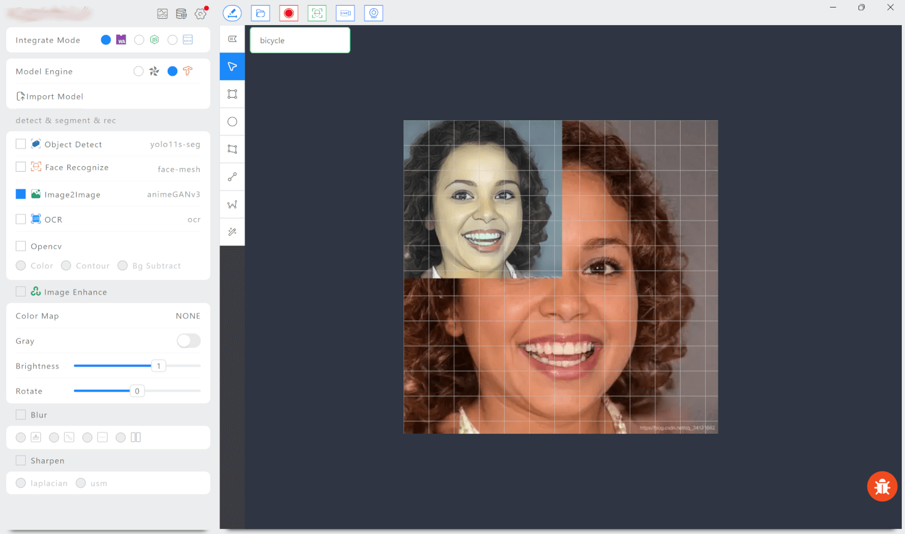
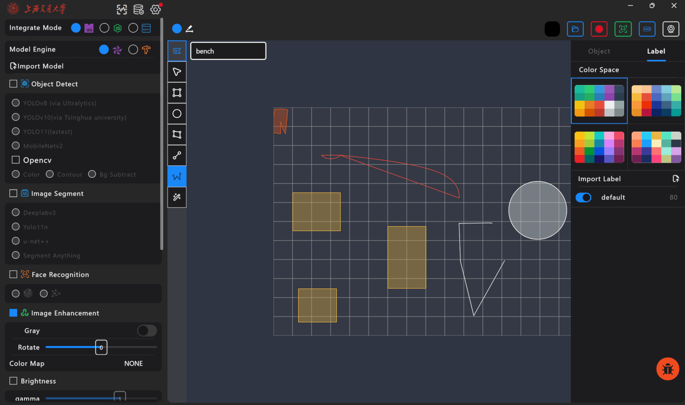
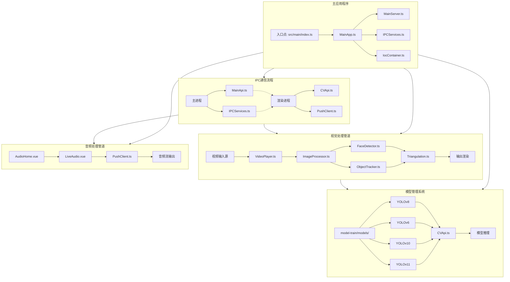

# Vision Ultra 项目介绍

> 基于 Electron 的跨平台视觉处理应用  
> 版本：1.0.0  
> 作者：maskerliu  
> 仓库：VisionUltra  

---

## 1. 项目概述

**Vision Ultra** 是一款面向计算机视觉与多媒体分析的跨平台桌面应用。它以 **Electron** 为容器，集成 **Vue 3 + TypeScript** 前端界面、**OpenCV** 图像处理、**YOLO** 系列目标检测/分割、**MediaPipe** 人脸检测与关键点定位、**TensorFlow.js** 模型推理以及实时音视频流处理等能力，适用于视频分析、模型调试、图像标注、AI 辅助创作等场景。

项目采用 Monorepo 结构管理，核心代码位于 `cv-desktop/` 工作区，根目录保留公共资源、数据集、模型训练产物与证书配置。



---

## 2. 核心功能

### 2.1 多源输入支持

支持多种媒体输入方式：

- 本地图片（PNG / JPG / JPEG / GIF / BMP / WebP）
- 本地视频文件
- 实时摄像头 / 屏幕捕获
- 网络视频流（HLS / RTMP / WebRTC 等）
- 实时音频流

### 2.2 图像处理

基于 OpenCV 提供常用图像处理算子：

| 类别 | 能力 |
|------|------|
| 几何变换 | 旋转、缩放、裁剪、透视变换 |
| 色彩空间 | 灰度、BGR/RGB/HSV 转换、色彩映射 |
| 滤波增强 | 高斯模糊、中值滤波、双边滤波、锐化、Gamma 校正、直方图均衡化 |
| 形态学 | 膨胀、腐蚀、开运算、闭运算 |
| 边缘检测 | Canny、Sobel、Laplacian、 findContours |
| 二值化 | 阈值处理、自适应阈值 |

图像处理同时支持三种运行形态：

1. **Web 形态**：渲染进程通过 `@opencvjs/web`（WebAssembly）在浏览器环境运行。
2. **Worker 形态**：CPU 密集型操作下沉到 Web Worker，避免阻塞 UI 主线程。
3. **Node 形态**：主进程通过 `@opencvjs/node`（原生绑定）执行高性能后端处理。



### 2.3 目标检测与分割

集成多个 YOLO 系列推理模型，支持检测与分割任务：

- **YOLOv8**（Ultralytics）
- **YOLOv10**（清华大学）
- **YOLOv11**（最新版本）
- 同时支持 Deeplab、MobileNet 等模型架构
- 支持自定义模型训练与热插拔部署

功能包括：

- 单图/视频流推理
- 目标框选、分类、置信度显示
- 实例分割掩膜渲染
- 目标跟踪（Object Tracking）
- 模型切换与参数实时调节





### 2.4 人脸检测与识别

基于 `@mediapipe/tasks-vision` 构建人脸能力：

- 实时人脸检测与 468 点面部关键点定位
- 特征点三角化与 3D 重建可视化
- 人脸特征提取（计划结合 LanceDB 存储与检索）
- 简洁的 Face DB 管理界面（开发中）



### 2.5 图像生成

支持基于 GAN 的图生图风格迁移，用于艺术化图像生成。



### 2.6 图形标注

内置 Fabric.js 驱动的标注编辑器：

- 矩形、圆、多边形、直线、点、文本
- 拖拽、缩放、旋转、删除
- 标注结果导出



### 2.7 音频处理

支持实时音频采集与推流：

- 麦克风输入捕获
- 音频可视化
- 与视频流同步处理

---

## 3. 技术架构

### 3.1 整体架构

```
┌─────────────────────────────────────────────────────────┐
│                      Electron 主进程                      │
│  ┌─────────────┐  ┌────────────────┐  ┌──────────────┐  │
│  │  MainApp    │  │  MainServer    │  │  IocContainer│  │
│  │ 窗口/托盘   │  │ Express/HTTP/2 │  │ 依赖注入容器  │  │
│  └─────────────┘  └────────────────┘  └──────────────┘  │
│         │                  │                 │          │
│  ┌─────────────┐  ┌────────────────┐  ┌──────────────┐  │
│  │ IPCServices │  │ Router Layer   │  │ Service Layer│  │
│  │ 系统对话框   │  │ /common /mapi  │  │ 业务逻辑服务  │  │
│  │ 更新/重启   │  │ /facerec       │  │              │  │
│  └─────────────┘  └────────────────┘  └──────────────┘  │
│         │                  │                            │
│  ┌─────────────┐  ┌────────────────┐                   │
│  │ cv.backend  │  │ Model Repo     │                   │
│  │ OpenCV Node │  │ PouchDB CRUD   │                   │
│  └─────────────┘  └────────────────┘                   │
│                         │                                │
│            contextBridge (preload.cjs)                   │
└─────────────────────────────────────────────────────────┘
                           │
          ┌────────────────┼────────────────┐
          │ Electron IPC   │ HTTP 127.0.0.1  │
          v                v                 v
┌─────────────────────────────────────────────────────────┐
│                     Electron 渲染进程                    │
│  ┌─────────────┐  ┌────────────────┐  ┌──────────────┐  │
│  │ Vue 3 SPA   │  │ Pinia Stores   │  │ Web Workers  │  │
│  │ Vant/TDesign│  │ Common/Vision  │  │ CV/Detection │  │
│  └─────────────┘  └────────────────┘  └──────────────┘  │
│       │                    │                 │           │
│  ┌─────────────┐  ┌────────────────┐                   │
│  │ main.api.ts │  │ ProcessorManager│                   │
│  │ IPC 客户端  │  │ Worker/Backend  │                   │
│  └─────────────┘  └────────────────┘                   │
└─────────────────────────────────────────────────────────┘
```

### 3.2 功能架构图



### 3.2 技术栈

| 层级 | 技术 |
|------|------|
| 桌面容器 | Electron 41.7.1 |
| 前端框架 | Vue 3.5.35 + Vue Router 5.1.0 + Pinia 3.0.4 |
| UI 组件 | Vant 4.9.22 + TDesign Vue Next 1.20.0 |
| 国际化 | vue-i18n 11.4.4 |
| 构建工具 | Webpack 5 + tsx + electron-builder |
| 进程通信 | Electron IPC + HTTP/HTTPS + SockJS |
| 后端框架 | Express 5.2.1 + http2-express |
| 依赖注入 | Inversify 8.1.0 |
| 数据库 | PouchDB 9.0.0（LevelDB 适配） |
| 图像处理 | @opencvjs/web / @opencvjs/node |
| 模型推理 | ONNX Runtime Web + TensorFlow.js 4.22.0 + MediaPipe Tasks Vision |
| 图表/可视化 | ECharts + Fabric.js 6.9.0 |
| 音频 | Tone.js + MediaChrome |
| 视频播放 | HLS.js + TCPlayer |

---

## 4. 目录结构

```
vision-ultra/
├── assets/                # 截图、预览图、设计资源
├── cert/                  # TLS 证书与脚本
├── cv-desktop/            # 核心 Electron 应用
│   ├── src/
│   │   ├── main/          # 主进程
│   │   │   ├── index.ts
│   │   │   ├── MainApp.ts
│   │   │   ├── MainServer.ts
│   │   │   ├── MainConst.ts
│   │   │   ├── IocContainer.ts
│   │   │   ├── IPCServices.ts
│   │   │   ├── Preload.ts
│   │   │   ├── AppUpdater.ts
│   │   │   ├── ipc/       # 原生后端（OpenCV/TensorFlow）
│   │   │   ├── mcp/       # MCP 服务端（开发中）
│   │   │   ├── misc/      # 工具函数
│   │   │   ├── repository/# PouchDB 数据仓库
│   │   │   ├── router/    # Express 路由
│   │   │   └── service/   # 业务服务
│   │   ├── renderer/      # 渲染进程
│   │   │   ├── index.ts
│   │   │   ├── common/    # OpenCV Web、处理器管理器、Workers
│   │   │   ├── model/     # 模型封装
│   │   │   ├── pages/     # 页面组件
│   │   │   ├── store/     # Pinia Store
│   │   │   └── router/    # Vue Router
│   │   └── shared/        # 主/渲染进程共享类型与 API
│   ├── .build-scripts/    # 自定义构建脚本
│   ├── electron-builder.yml
│   ├── tsconfig.json
│   └── package.json
├── data/                  # 运行时数据、预训练模型、任务文件
├── datasets/              # 训练数据集与标注
├── model-train/           # 模型训练产物（ONNX / PT / Bin / JSON）
├── test/                  # 测试资源
├── package.json           # 根 Monorepo 配置
├── tsconfig.json
├── README.md
└── yarn.lock
```

---

## 5. 主进程模块说明

### 5.1 `MainApp.ts`

- Electron 应用生命周期管理
- 主窗口创建、系统托盘、菜单
- 主题管理（light/dark/system）
- 防火墙自动放行（Windows `netsh`）
- 业务配置同步与广播

### 5.2 `MainServer.ts`

- Express HTTP/HTTPS 服务器
- HTTP/2 支持（通过 `http2-express`）
- 静态资源服务（模型、用户数据、内置资源）
- CORS 配置
- 媒体代理端点
- 路由挂载

### 5.3 `IPCServices.ts`

主进程 IPC 处理器集合：

| 命令 | 说明 |
|------|------|
| `Relaunch` | 应用重启/更新 |
| `SelectFile` | 文件选择对话框 |
| `SelectFolder` | 文件夹选择对话框 |
| `OpenFolder` | 打开系统文件管理器 |
| `SaveFileAs` | 保存文件到用户数据目录 |
| `OpenDevTools` | 打开开发者工具 |
| `SetAppTheme` | 设置应用主题 |
| `DownloadUpdate` | 下载全量/增量更新 |

### 5.4 `IocContainer.ts` + 路由层

使用 Inversify 实现依赖注入：

- 服务层：`CommonService`、`MapiService`、`PushService`、`FaceRecService`
- 路由层：`CommonRouter`、`MapiRouter`、`FaceRecRouter`
- 数据层：`ModelRepo`（PouchDB）

`BaseRouter` 通过反射 + 装饰器实现声明式路由分发，支持 Header / Path / Query / FormBody 参数解析。

### 5.5 `cv.backend.ts`

主进程原生 OpenCV 后端，暴露给渲染进程通过 `contextBridge` 调用。与 `CVProcessor.ts`（Web 形态）共享算法逻辑。

---

## 6. 渲染进程模块说明

### 6.1 `CVProcessor.ts`

渲染进程 OpenCV 处理器，基于 `@opencvjs/web` WASM 实现，用于前端快速预览和低延迟处理。

### 6.2 `ProcessorManager` 体系

```
ProcessorManager（抽象）
   ├── WorkerManager → 调度 Web Worker
   └── BackendManager → 调用主进程原生后端
```

通过统一接口屏蔽运行环境差异，业务代码可按需切换处理后端。

### 6.3 Web Workers

- `CVProcess.worker.ts`：通用图像处理
- 目标检测、分割、跟踪 Worker
- 人脸检测 Worker
- OCR Worker

### 6.4 Pinia Store

- `Common`：通用应用状态、业务配置
- `Vision`：视觉处理状态、模型、输入源
- `Audio`：音频流状态
- `AI`：AI 对话/生成状态

### 6.5 页面结构

- `ai/`：AI 对话、图生图
- `vision/`：视觉处理、模型推理
- `annotation/`：图像标注
- `audio/`：音频处理
- `settings/`：应用设置

---

## 7. 通信机制

### 7.1 Electron IPC

用于系统级操作（文件选择、重启、主题切换、更新）。

- 主进程：`ipcMain.handle`
- 渲染进程：`ipcRenderer.invoke`
- 预加载脚本：`contextBridge.exposeInMainWorld('mainApi', ...)`

### 7.2 HTTP API

渲染进程通过 axios 与主进程 Express 服务器通信：

- 默认地址：`//127.0.0.1:8884`
- 请求自动附带 `x-mock-uid` 头部
- 业务路由：`/common`、`/mapi`、`/facerec`

### 7.3 SockJS 实时推送

`PushService` 提供 `/echo` 端点，支持：

- 客户端注册
- 广播消息
- 实时状态推送

---

## 8. 模型管理

### 8.1 模型扫描

`CommonService` 扫描用户配置的 `modelPath`，识别以下格式：

- `.onnx` — ONNX Runtime
- `.json` — 模型配置
- `.tflite` — TensorFlow Lite
- `.bin` — 权重文件
- `.task` — MediaPipe Task 模型

### 8.2 模型元数据

模型信息存储在 PouchDB 中，支持：

- 名称、类型、路径、框架版本
- 启用/禁用状态
- 自定义参数

### 8.3 静态服务

主进程将模型目录作为静态资源暴露，供渲染进程按需加载：

```typescript
app.use('/static', express.static(config.modelPath))
```

---

## 9. 开发环境

### 9.1 前置要求

- Node.js 22.x（项目使用 yarn 4.13.0）
- Python 3.11+（用于 node-gyp 构建原生模块）
- Windows：Visual Studio Build Tools / C++ 工作负载
- macOS：Xcode Command Line Tools
- Linux：`build-essential`、libopencv-dev

### 9.2 安装依赖

```bash
# 克隆仓库
git clone https://github.com/your-username/vision-ultra.git
cd vision-ultra

# 安装依赖（使用 yarn 4 workspace）
yarn install
```

### 9.3 开发模式

```bash
# 根目录
yarn dev

# 或进入 cv-desktop
yarn workspace cv-desktop run dev
```

开发脚本会同时启动：

- Webpack Dev Server（渲染进程热更新）
- Electron 主进程（tsx 热重载）

### 9.4 构建

```bash
# 构建应用（不打包）
yarn build

# 清理构建
yarn build:clean

# 打包安装包
yarn pkg

# 发布完整更新
yarn pub:full
```

### 9.5 原生模块重建

项目涉及 OpenCV 等原生模块，首次构建可能需要：

```bash
yarn rebuild
# 或
yarn electron-rebuild
yarn opencv:build
```

> 注意：原生构建耗时较长，请确保网络畅通并耐心等待。

---

## 10. 配置说明

### 10.1 默认端口

```json
{
  "port": 8884,
  "protocol": "https"
}
```

在 `cv-desktop/package.json` 的 `config` 字段中定义。

### 10.2 用户数据目录

根据操作系统自动定位：

- Windows：`%APPDATA%/VisionUltra/`
- macOS：`~/Library/Application Support/VisionUltra/`
- Linux：`~/.config/VisionUltra/`

### 10.3 业务配置

运行时配置（模型路径、主题、语言等）保存在 `USER_DATA_DIR/biz_storage` 中。

### 10.4 TLS 证书

HTTPS/HTTP2 使用 `cert/` 目录下的证书。开发环境可生成自签名证书。

---

## 11. 已知限制与注意事项

1. **原生模块体积较大**：OpenCV、TensorFlow.js、ONNX 等会增加安装包体积，建议按需分包。
2. **首次构建耗时**：node native 模块编译可能需要数分钟到数十分钟。
3. **OpenCV 后端选择**：Web WASM 便于分发但性能低于 Node 原生后端，重负载场景建议使用 Node 后端。
4. **MCP 服务端**：`src/main/mcp/` 目录下文件目前为空，MCP 功能尚未完成。
5. **人脸数据库**：LanceDB 集成部分被注释，Face DB 功能仍在开发中。
6. **安全设置**：当前代码出于开发便利关闭了部分 Electron 安全选项（如 `webSecurity`、`sandbox`），生产环境需重新评估并开启。

---

## 12. 扩展开发

### 12.1 添加新路由

1. 在 `src/main/router/` 创建新 Router 类，继承 `BaseRouter`。
2. 在 `src/main/service/` 创建对应 Service。
3. 在 `IocContainer.ts` 中绑定服务与路由。
4. 在 `MainServer.ts` 中挂载路由。

### 12.2 添加新图像处理算子

1. 在 `src/shared/cv/`（建议新建）或 `CVProcessor.ts`/`cv.backend.ts` 中实现核心算法。
2. 在 `ProcessorManager` 中注册算子。
3. 在 Vue 页面中添加对应 UI 控件。

### 12.3 添加新模型

1. 将模型文件放入配置的 `modelPath`。
2. 在页面中通过 `/static/模型名` 加载。
3. 在 `ModelStore` 中注册模型配置。

---

## 13. 相关资源

- [视觉艺术在线平台](https://www.wikiart.org/)
- [COCO 数据集](https://cocodataset.org/)
- [ADE20K 数据集](https://ade20k.csail.mit.edu/)
- [EasyOCR](https://easyocr.org/)
- [Ultralytics YOLOv8](https://docs.ultralytics.com/)
- [MediaPipe Vision Tasks](https://developers.google.com/mediapipe/solutions/vision)
- [ONNX Runtime](https://onnxruntime.ai/)

---

## 14. 许可证

`UNLICENSED`（当前未指定开源许可证）。

---

> 本文档基于 `README.md` 与项目源码整理，随着版本迭代可能需要同步更新。
