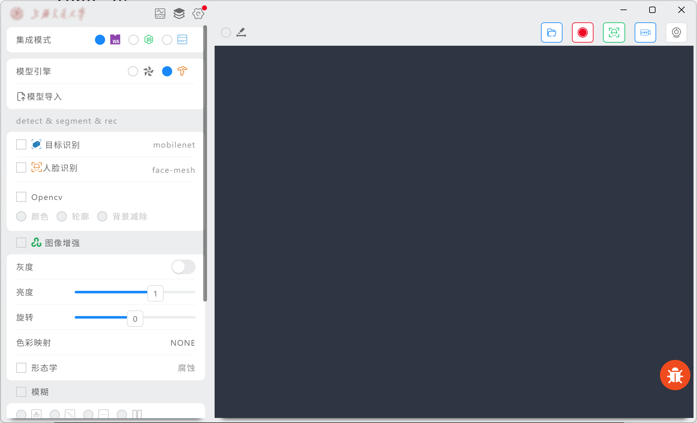
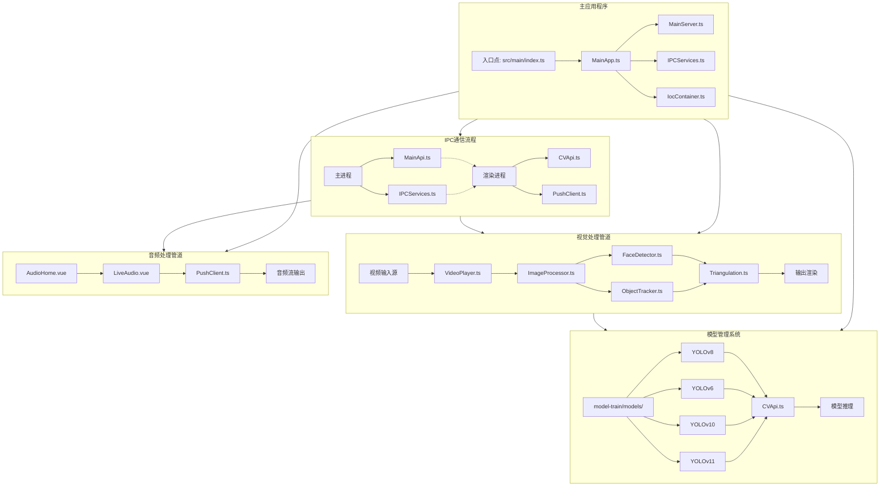
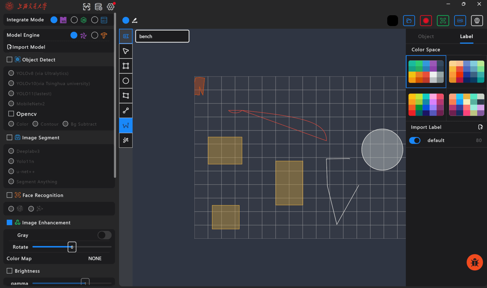
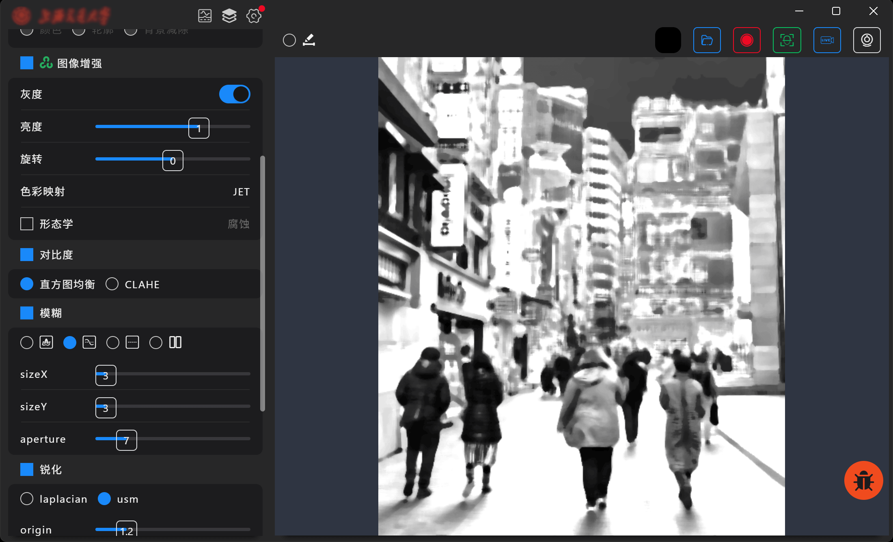
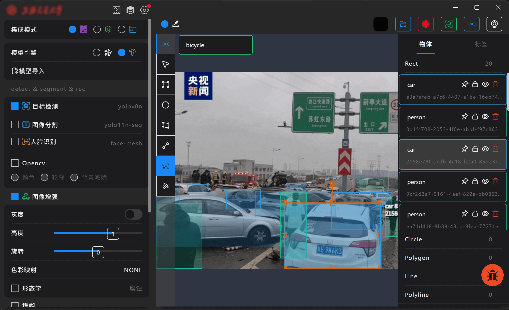
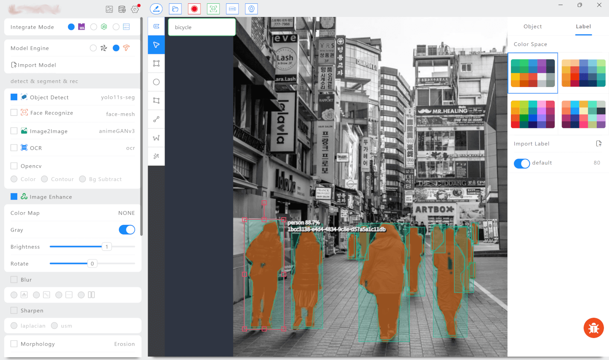
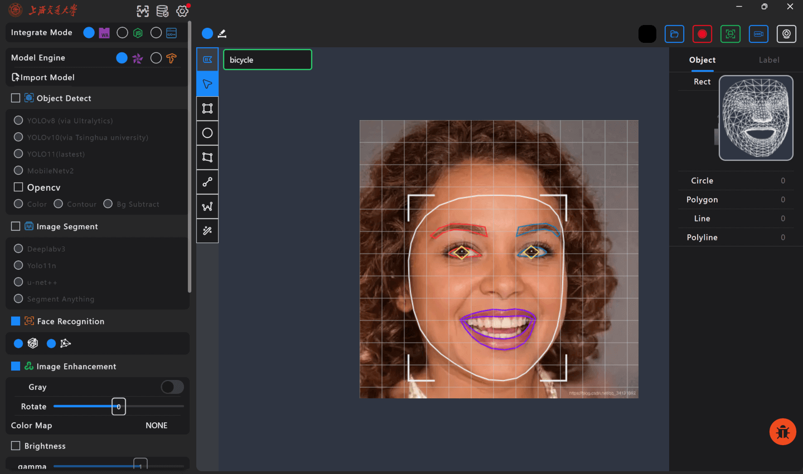

### Vision Ultra



#### 1. 简介

这是一个基于 Electron 的跨平台视觉处理应用程序，主要功能包括实时视频分析、人脸识别、目标检测和音频流处理。



#### 2. 功能

- 基础功能：

  - 多格式图片、视频、实时音视频流、摄像头等多源输入支持。
  - 基础图形标注支持
    矩形、圆、多边形、直线、点、文本等图形的绘制和编辑，支持图形的拖拽、缩放、旋转、删除等操作。

  

- 图像处理：
  OpenCV 常见图像处理方法，支持旋转、模糊、色彩空间、灰度、滤波等。
  支持 web、wsam、node-napi 不同形态的图像处理，方便前后端分离设计。

  

- 目标分割检测与跟踪：
  基于 Deeplab、YOLO、MobileNet 等高性能模型目标检测，支持 YOLO 系列模型：
  _YOLOv8 (Ultralytics)_
  _YOLOv10 (清华大学)_
  _YOLOv11 (最新版)_
  支持自定义模型训练与部署，拓展性高。
  检测
  
  分割
  

- 人脸检测：实现人脸识别和特征提取
  在`@mediapipe/tasks-vision`基础上，实现实时人脸检测和关键点定位，特征点三角化、3D 重建等，友好的可视化支持，方便更为直观的分析结果。
  结合`lancedb`，实现人脸特征数据存储与检索，并构建了简洁的 Face DB 管理模块，方便数据的管理与分析。
  

#### 技术特点

- 跨平台支持：基于 Electron，支持 Windows、macOS 和 Linux
- Backend 模块化：采用依赖注入（IoC Container）管理组件，提高代码可维护性和扩展性
- 多模型支持：集成多个 YOLO 版本，可根据需求选择
- 前端 web worker 分离耗时模块：利用 web worker 实现多线程处理，提高性能，保证前台高帧率。
- 合理的前后分离设计：利用 electron-ipc 实现进程间通信，保证前后端分离，将部分耗时图像处理、高计算密集型逻辑后移，降低渲染进程开销。
- Web 技术栈：使用 Vue 3 + TypeScript 构建用户界面，开发调试方便，上手成本低，且易于维护。

#### 安装

1. 克隆仓库到本地：

```bash
git clone https://github.com/your-username/vision-ultra.git
```

2. 安装依赖：

```bash
cd vision-ultra
yarn
```

3. 开发模式启动项目：

```bash
yarn dev
```

项目中使用到如`lancedb`、`tfjs-node`、`opencv4nodejs`等库，请确保已正确安装并配置好这些依赖。初次构建涉及到相关模块的 node native 构建，可能需要一些时间，请耐心等待。
