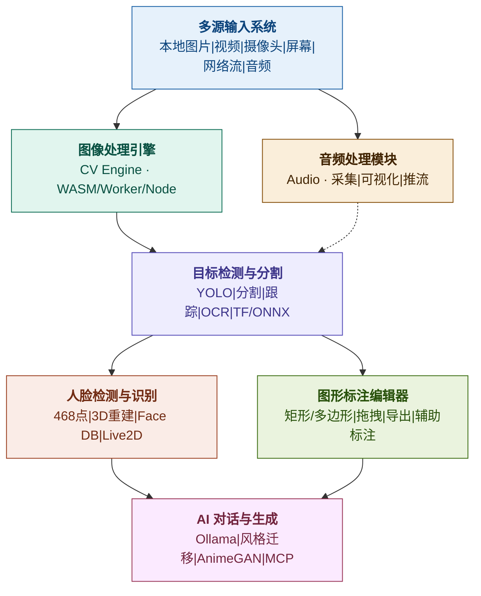

# Vision Ultra 产品需求规格文档（PRD）

> 版本：v1.0  
> 日期：2026-06-18  
> 作者：产品通（基于项目源码分析）  
> 状态：初稿

---

## 一、产品概述

### 1.1 产品定位

**Vision Ultra** 是一款面向计算机视觉与多媒体分析领域的跨平台桌面应用，以 Electron 为容器，集成图像处理、目标检测/分割、人脸识别、图形标注、音频处理及 AI 对话等能力，服务于视频分析、模型调试、图像标注、AI 辅助创作等场景。

**目标用户**：
- CV 工程师/研究员：需要快速验证模型效果、调试推理参数
- 数据标注团队：需要高效的标注工具产出训练数据
- 内容创作者：需要 AI 辅助的图像风格迁移与生成
- 多媒体分析师：需要视频流的实时检测与跟踪

### 1.2 核心价值主张

| 用户痛点 | Vision Ultra 解决方式 |
|---------|----------------------|
| 模型调试需反复编写脚本 | 内置可视化推理面板，参数实时调节 |
| 标注工具与推理工具割裂 | 标注编辑器与检测结果联动 |
| WASM 性能瓶颈 vs 原生部署复杂 | 三种运行形态（WASM/Worker/Node）可切换 |
| 多模型管理混乱 | PouchDB 模型仓库 + 热插拔部署 |

### 1.3 产品北极星指标

**每周活跃推理会话数**（用户每周在应用中完成的有效推理/处理会话次数）——直接衡量产品核心价值交付。

---

## 二、功能模块需求规格

---

### 模块 1：多源输入系统（Input Hub）

#### 2.1.1 Why（解决什么问题）

用户需要从多种来源获取视觉/音频数据作为处理管线输入，当前市面工具往往只支持单一输入方式，导致工作流断裂。

#### 2.1.2 用户故事

| # | 用户故事 | 优先级 |
|---|---------|--------|
| US-1-1 | 作为 CV 工程师，我希望拖拽本地图片/视频到应用中直接开始处理，以便快速验证模型效果 | P0 |
| US-1-2 | 作为视频分析师，我希望接入网络摄像头进行实时推理，以便做现场检测 | P0 |
| US-1-3 | 作为多媒体研究者，我希望播放 HLS/RTMP 网络流并实时处理，以便分析远程视频源 | P1 |
| US-1-4 | 作为内容创作者，我希望截取屏幕画面作为输入，以便对屏幕内容做 OCR 或检测 | P1 |
| US-1-5 | 作为音频工程师，我希望采集麦克风音频并可视化，以便同步分析音视频 | P2 |

#### 2.1.3 功能范围（Goals）

- 支持本地图片：PNG / JPG / JPEG / GIF / BMP / WebP
- 支持本地视频文件播放
- 支持实时摄像头采集
- 支持屏幕捕获
- 支持网络视频流（HLS / RTMP / WebRTC）
- 支持实时音频采集

#### 2.1.4 Non-goals（不做什么）

- 不做视频编辑/剪辑功能
- 不做视频录制与保存（仅做实时处理）
- 不做 IPTV/直播平台专用适配
- 不支持 RTSP 协议（当前版本）

#### 2.1.5 当前状态评估

| 功能 | 实现状态 | 质量评估 |
|------|---------|---------|
| 本地图片输入 | ✅ 已实现 | 稳定，支持 6 种格式 |
| 本地视频输入 | ✅ 已实现 | 基于 TCPlayer + HLS.js |
| 摄像头采集 | ✅ 已实现 | 基于 getUserMedia |
| 屏幕捕获 | ✅ 已实现 | 基于 Electron desktopCapturer |
| 网络视频流 | ✅ 已实现 | HLS/RTMP 支持 |
| 音频采集 | ⚠️ 部分实现 | 页面存在但 Audio Store 为空 |

#### 2.1.6 指标

| 指标类型 | 指标名 | 基线 | 目标 |
|---------|--------|------|------|
| 驱动指标 | 输入源切换成功率 | — | > 95% |
| 驱动指标 | 首次输入到处理的耗时 | — | < 3s |
| 健康指标 | 视频流帧率稳定性 | — | > 24fps（摄像头/网络流） |

---

### 模块 2：图像处理引擎（CV Engine）

#### 2.2.1 Why

CV 工程师和数据标注员需要快速对图像做预处理（增强、滤波、形态学等），传统方式需编写 Python 脚本，效率低且不可交互。

#### 2.2.2 用户故事

| # | 用户故事 | 优先级 |
|---|---------|--------|
| US-2-1 | 作为 CV 工程师，我希望实时调节高斯模糊参数并看到效果，以便快速找到最佳预处理参数 | P0 |
| US-2-2 | 作为数据标注员，我希望一键做直方图均衡化，以便提升低对比度图像的可读性 | P0 |
| US-2-3 | 作为研究者，我希望自由切换 WASM/Worker/Node 三种运行形态，以便权衡分发便捷性与性能 | P0 |
| US-2-4 | 作为 CV 工程师，我希望组合多个算子成管线，以便实现复杂预处理流程 | P1 |
| US-2-5 | 作为研究者，我希望导出处理后的图像，以便在论文/报告中使用 | P1 |

#### 2.2.3 功能范围（Goals）

- 几何变换：旋转、缩放、裁剪、透视变换
- 色彩空间：灰度、BGR/RGB/HSV 转换、色彩映射
- 滤波增强：高斯模糊、中值滤波、双边滤波、锐化、Gamma 校正、直方图均衡化
- 形态学：膨胀、腐蚀、开运算、闭运算
- 边缘检测：Canny、Sobel、Laplacian、findContours
- 二值化：阈值处理、自适应阈值
- 三种运行形态：WASM / Worker / Node 可切换

#### 2.2.4 Non-goals

- 不做图像压缩/编码优化
- 不做频域处理（FFT/DCT）
- 不做 3D 图像/体积数据处理
- 不做自动参数推荐（当前版本）

#### 2.2.5 当前状态评估

| 功能 | 实现状态 | 质量评估 |
|------|---------|---------|
| 几何变换 | ✅ 已实现 | 覆盖核心操作 |
| 色彩空间 | ✅ 已实现 | BGR/RGB/HSV + 色彩映射 |
| 滤波增强 | ✅ 已实现 | 6 种滤波算子 |
| 形态学 | ✅ 已实现 | 4 种形态学算子 |
| 边缘检测 | ✅ 已实现 | Canny + Sobel + Laplacian + findContours |
| 二值化 | ✅ 已实现 | 阈值 + 自适应阈值 |
| WASM 形态 | ✅ 已实现 | CVProcessor.ts + @opencvjs/web |
| Worker 形态 | ✅ 已实现 | CVProcess.worker.ts |
| Node 形态 | ✅ 已实现 | cv.backend.ts + @opencvjs/node |
| Native 形态 | ❌ 已废弃 | cv.native.ts 全部注释 |

#### 2.2.6 指标

| 指标类型 | 指标名 | 基线 | 目标 |
|---------|--------|------|------|
| 驱动指标 | 单图处理响应时间（WASM） | — | < 500ms (1080p) |
| 驱动指标 | 单图处理响应时间（Node） | — | < 100ms (1080p) |
| 健康指标 | WASM 初始化时间 | — | < 5s |
| 健康指标 | Worker 消息传递延迟 | — | < 50ms |

---

### 模块 3：目标检测与分割（Detection & Segmentation）

#### 2.3.1 Why

CV 工程师需要可视化验证 YOLO 等模型的推理效果并实时调参，当前缺少集成多模型+可视化+调参的一体化桌面工具。

#### 2.3.2 用户故事

| # | 用户故事 | 优先级 |
|---|---------|--------|
| US-3-1 | 作为 CV 工程师，我希望对单张图片运行 YOLOv8/v10/v11 推理并看到检测框，以便快速验证模型效果 | P0 |
| US-3-2 | 作为视频分析师，我希望对视频流做实时目标检测，以便在监控场景中实时发现目标 | P0 |
| US-3-3 | 作为研究者，我希望在检测和分割之间一键切换模型，以便对比不同任务的效果 | P0 |
| US-3-4 | 作为工程师，我希望实时调节置信度阈值和 NMS 参数，以便找到最优检测配置 | P0 |
| US-3-5 | 作为分析师，我希望对检测目标做持续跟踪，以便分析目标的运动轨迹 | P1 |
| US-3-6 | 作为工程师，我希望热插拔自定义 ONNX 模型，以便验证自己训练的模型 | P1 |
| US-3-7 | 作为研究者，我希望切换 TF/ONNX 推理引擎，以便对比引擎性能差异 | P2 |

#### 2.3.3 功能范围（Goals）

- 单图推理：目标框选、分类、置信度显示
- 视频流实时推理
- 实例分割掩膜渲染
- 目标跟踪（Object Tracking）
- 多 YOLO 模型切换（v8/v10/v11 + Deeplab/MobileNet）
- 模型参数实时调节（置信度阈值、NMS 参数）
- 自定义模型热插拔部署
- TF / ONNX 双引擎支持

#### 2.3.4 Non-goals

- 不做模型训练 UI（训练通过 model-train 目录 + 命令行完成）
- 不做姿态估计（Pose Estimation）可视化（当前版本，ModelType 已定义但未实现 UI）
- 不做 OBB（旋转框检测）可视化（当前版本）
- 不做分布式推理/多 GPU 调度

#### 2.3.5 当前状态评估

| 功能 | 实现状态 | 质量评估 |
|------|---------|---------|
| 单图检测推理 | ✅ 已实现 | YOLO 系列 + 多引擎 |
| 视频流实时检测 | ✅ 已实现 | WorkerManager 调度 |
| 实例分割 | ✅ 已实现 | 掩膜渲染 |
| 目标跟踪 | ✅ 已实现 | ObjectTracker.ts |
| 模型切换 | ✅ 已实现 | VisionStore + Model.ts |
| 参数调节 | ✅ 已实现 | DetectRec.vue 控制面板 |
| 自定义模型热插拔 | ⚠️ 部分实现 | 模型扫描+静态服务存在，管理界面简陋 |
| TF/ONNX 双引擎 | ✅ 已实现 | Model.ts 基类封装 |
| Pose/OBB 可视化 | ❌ 未实现 | ModelType 定义了但无 UI |

#### 2.3.6 指标

| 指标类型 | 指标名 | 基线 | 目标 |
|---------|--------|------|------|
| 北极星关联 | 每周推理会话数 | — | > 100 次/周 |
| 驱动指标 | 单图推理耗时（YOLOv8s） | — | < 200ms (ONNX) |
| 驱动指标 | 视频流推理帧率 | — | > 15fps |
| 健康指标 | 模型加载成功率 | — | > 98% |

---

### 模块 4：人脸检测与识别（Face Recognition）

#### 2.4.1 Why

安防/娱乐场景需要实时人脸检测与特征提取，当前缺少将检测、特征向量存储、检索融为一体的桌面端工具。

#### 2.4.2 用户故事

| # | 用户故事 | 优先级 |
|---|---------|--------|
| US-4-1 | 作为安防分析师，我希望实时检测视频流中的人脸并标注 468 个关键点，以便做人脸定位 | P0 |
| US-4-2 | 作为开发者，我希望查看人脸关键点的三角化 3D 重建，以便理解特征分布 | P1 |
| US-4-3 | 作为安防管理员，我希望注册人脸到 Face DB 并做 1:N 识别，以便实现人脸检索 | P1 |
| US-4-4 | 作为内容创作者，我希望用关键点数据驱动 Live2D 虚拟形象，以便做虚拟主播 | P2 |
| US-4-5 | 作为管理员，我希望在 Face DB 界面管理已注册人脸（增删查），以便维护人脸库 | P1 |

#### 2.4.3 功能范围（Goals）

- 实时人脸检测与 468 点关键点定位
- 关键点三角化与 3D 重建可视化
- 人脸特征提取与存储
- Face DB 管理（注册/删除/检索）
- Live2D 虚拟形象驱动

#### 2.4.4 Non-goals

- 不做人脸属性分析（年龄/性别/表情分类）
- 不做大规模人脸检索（> 10 万级别，需服务端）
- 不做人脸 3D 模型重建输出
- 不做视频级人脸轨迹追踪（当前版本）

#### 2.4.5 当前状态评估

| 功能 | 实现状态 | 质量评估 |
|------|---------|---------|
| 人脸检测 + 468 点定位 | ✅ 已实现 | MediaPipe Tasks Vision |
| 三角化 3D 可视化 | ✅ 已实现 | Triangulation.ts + DrawUtils.ts |
| Face DB 管理 | ⚠️ 开发中 | FaceDbMgr.vue 存在，LanceDB 集成被注释 |
| Face DB API | ✅ 已实现 | FaceRecRouter + FaceRecService |
| Live2D 驱动 | ✅ 已实现 | Live2dPanel.vue + kalidokit |
| LanceDB 向量存储 | ❌ 未完成 | 代码被注释，需恢复 |

#### 2.4.6 指标

| 指标类型 | 指标名 | 基线 | 目标 |
|---------|--------|------|------|
| 驱动指标 | 人脸检测延迟 | — | < 100ms (单帧) |
| 驱动指标 | Face DB 注册成功率 | — | > 95% |
| 遵从指标 | 人脸数据本地存储合规 | — | 100% 本地处理，不上传云端 |

---

### 模块 5：图形标注编辑器（Annotation Editor）

#### 2.5.1 Why

数据标注团队需要高效的标注工具产出训练数据，当前市面工具要么功能单一，要么与推理工具割裂，标注结果无法直接用于模型验证。

#### 2.5.2 用户故事

| # | 用户故事 | 优先级 |
|---|---------|--------|
| US-5-1 | 作为标注员，我希望在图片上画矩形框标注目标，以便产出目标检测训练数据 | P0 |
| US-5-2 | 作为标注员，我希望画多边形标注不规则区域，以便产出分割训练数据 | P0 |
| US-5-3 | 作为标注员，我希望拖拽/缩放/旋转已标注图形，以便修正标注精度 | P0 |
| US-5-4 | 作为标注团队 Lead，我希望导出标注结果为标准格式（JSON/YOLO/COCO），以便直接用于训练 | P1 |
| US-5-5 | 作为标注员，我希望将检测结果一键转为标注，以便利用模型辅助标注 | P1 |
| US-5-6 | 作为标注员，我希望为标注添加标签/分类信息，以便产出结构化训练数据 | P1 |

#### 2.5.3 功能范围（Goals）

- 支持标注类型：矩形、圆、多边形、直线、点、文本
- 拖拽、缩放、旋转、删除标注
- 标注结果导出
- 标注标签/分类管理
- 模型辅助标注（检测结果 → 标注转换）

#### 2.5.4 Non-goals

- 不做多人协作标注（当前版本为单人标注）
- 不做视频标注（仅做图像标注）
- 不做自动标注（仅做模型辅助半自动标注）
- 不做 3D 标注

#### 2.5.5 当前状态评估

| 功能 | 实现状态 | 质量评估 |
|------|---------|---------|
| 矩形标注 | ✅ 已实现 | Fabric.js 驱动 |
| 圆标注 | ✅ 已实现 | |
| 多边形标注 | ✅ 已实现 | |
| 直线/点/文本 | ✅ 已实现 | |
| 拖拽/缩放/旋转 | ✅ 已实现 | Fabric.js 内置 |
| 标注导出 | ⚠️ 部分实现 | 仅导出 JSON，缺 YOLO/COCO 格式 |
| 标签分类管理 | ⚠️ 部分实现 | LabelGroupTab + MarkerGroupTab 存在 |
| 模型辅助标注 | ❌ 未实现 | 检测结果未联动到标注编辑器 |

#### 2.5.6 指标

| 指标类型 | 指标名 | 基线 | 目标 |
|---------|--------|------|------|
| 驱动指标 | 单图标注完成时间 | — | < 2min（10 个目标） |
| 驱动指标 | 标注导出成功率 | — | > 99% |
| 健康指标 | 标注编辑器 FPS | — | > 30fps |

---

### 模块 6：音频处理（Audio Processing）

#### 2.6.1 Why

多媒体分析师需要同步处理音视频数据，当前视觉工具普遍忽视音频维度，导致音视频分析工作流断裂。

#### 2.6.2 用户故事

| # | 用户故事 | 优先级 |
|---|---------|--------|
| US-6-1 | 作为音频工程师，我希望采集麦克风音频并实时可视化波形，以便做音频监测 | P1 |
| US-6-2 | 作为多媒体分析师，我希望音视频同步处理，以便做音视频联合分析 | P2 |
| US-6-3 | 作为工程师，我希望将音频推流到远端，以便做远程音频传输 | P2 |

#### 2.6.3 功能范围（Goals）

- 麦克风输入捕获
- 音频可视化（波形/频谱）
- 与视频流同步处理
- 音频推流

#### 2.6.4 Non-goals

- 不做音频编辑/剪辑
- 不做语音识别（ASR）
- 不做音频降噪/增强算法
- 不做多声道混音

#### 2.6.5 当前状态评估

| 功能 | 实现状态 | 质量评估 |
|------|---------|---------|
| 音频采集页面 | ✅ 页面存在 | AudioHome.vue + LiveAudio.vue |
| 音频可视化 | ⚠️ 需验证 | Tone.js 已集成 |
| 音视频同步 | ❌ 未实现 | 无联动机制 |
| 音频推流 | ⚠️ 部分实现 | PushClient.ts 存在 |
| Audio Store | ❌ 空文件 | 状态管理未实现 |

#### 2.6.6 指标

| 指标类型 | 指标名 | 基线 | 目标 |
|---------|--------|------|------|
| 健康指标 | 音频采集延迟 | — | < 50ms |
| 健康指标 | 音频可视化帧率 | — | > 30fps |

---

### 模块 7：AI 对话与生成（AI Chat & Generation）

#### 2.7.1 Why

内容创作者和研究者希望通过自然语言对话方式调用 AI 能力，当前 CV 工具缺少对话式交互入口。

#### 2.7.2 用户故事

| # | 用户故事 | 优先级 |
|---|---------|--------|
| US-7-1 | 作为研究者，我希望通过对话界面调用本地 Ollama 模型，以便做 AI 辅助分析 | P1 |
| US-7-2 | 作为内容创作者，我希望做图生图风格迁移（如 Ghibli 风格），以便产出艺术化图像 | P1 |
| US-7-3 | 作为开发者，我希望通过 MCP 协议接入外部 AI 服务，以便扩展 AI 能力 | P2 |

#### 2.7.3 功能范围（Goals）

- AI 对话界面（对接 Ollama）
- 图生图风格迁移（GAN）
- 动漫风格生成（AnimeGAN）
- MCP 协议接入（计划）

#### 2.7.4 Non-goals

- 不做 AI 对话的云端服务（仅对接本地模型）
- 不做文生图（当前仅做图生图）
- 不做 AI 训练/微调 UI

#### 2.7.5 当前状态评估

| 功能 | 实现状态 | 质量评估 |
|------|---------|---------|
| AI 对话界面 | ✅ 已实现 | ai/index.vue + Chat.vue + AIStore |
| Ollama 对接 | ✅ 已实现 | AIStore 含 Ollama 配置 |
| 图生图（风格迁移） | ✅ 已实现 | StyleTransfer.ts + AnimeGenerator.ts |
| 动漫风格生成 | ✅ 已实现 | AnimeGANv3-Ghibli |
| MCP 服务端 | ❌ 空壳 | MCPServer.ts / MCPHttpEndpoints.ts 为空 |
| MCP 客户端 | ❌ 空壳 | MCPClient.ts 为空 |

#### 2.7.6 指标

| 指标类型 | 指标名 | 基线 | 目标 |
|---------|--------|------|------|
| 驱动指标 | 图生图处理耗时 | — | < 5s (512x512) |
| 健康指标 | AI 对话响应成功率 | — | > 90% |

---

### 模块 8：应用基础设施（App Infrastructure）

#### 2.8.1 Why

跨平台桌面应用需要稳定的基础设施支撑，包括窗口管理、通信机制、配置管理、数据持久化和自动更新。

#### 2.8.2 用户故事

| # | 用户故事 | 优先级 |
|---|---------|--------|
| US-8-1 | 作为用户，我希望应用支持 light/dark/system 主题切换，以便适应不同工作环境 | P0 |
| US-8-2 | 作为用户，我希望应用自动检测并下载更新，以便获取最新功能 | P0 |
| US-8-3 | 作为用户，我希望应用配置（模型路径、语言等）持久化保存，以便下次启动保持设置 | P0 |
| US-8-4 | 作为国际用户，我希望切换中/英文界面，以便使用熟悉的语言 | P1 |

#### 2.8.3 功能范围（Goals）

- Electron 窗口/托盘/菜单管理
- 主题管理（light/dark/system）
- 自动更新（全量/增量）
- 配置持久化（PouchDB + 本地文件）
- 国际化（zh-CN / en）
- IPC 通信（主进程 ↔ 渲染进程）
- HTTP API 服务（Express + HTTP/2）

#### 2.8.4 Non-goals

- 不做多窗口/多标签页架构
- 不做插件系统（当前版本）
- 不做云端账号体系（当前为本地单用户）

#### 2.8.5 当前状态评估

| 功能 | 实现状态 | 质量评估 |
|------|---------|---------|
| 窗口/托盘/菜单 | ✅ 已实现 | MainApp.ts |
| 主题切换 | ✅ 已实现 | IPCServices + Settings |
| 自动更新 | ✅ 已实现 | AppUpdater.ts |
| 配置持久化 | ✅ 已实现 | biz_storage + PouchDB |
| 国际化 | ✅ 已实现 | vue-i18n zh-CN/en |
| IPC 通信 | ✅ 已实现 | contextBridge + ipcMain |
| HTTP API | ✅ 已实现 | Express + HTTP/2 |
| 安全设置 | ⚠️ 需修复 | webSecurity/sandbox 被关闭 |

---

## 三、未完成功能清单与风险评估

| 未完成项 | 模块 | 风险等级 | 说明 |
|---------|------|---------|------|
| LanceDB 人脸向量存储 | 模块4 | 🔴 高 | Face DB 核心依赖，代码被注释 |
| MCP 服务端/客户端 | 模块7 | 🟡 中 | 空壳文件，AI 扩展入口 |
| Audio Store 状态管理 | 模块6 | 🟡 中 | 空文件，音频功能无法正常运作 |
| YOLO/COCO 格式导出 | 模块5 | 🟡 中 | 标注导出格式单一 |
| 模型辅助标注联动 | 模块5 | 🟡 中 | 检测结果未联动到标注编辑器 |
| Pose/OBB 可视化 | 模块3 | 🟢 低 | ModelType 定义但无 UI |
| 安全设置修复 | 模块8 | 🔴 高 | 生产环境必须开启 sandbox/webSecurity |
| Native 运行形态 | 模块2 | 🟢 低 | 已废弃，WASM+Node 足够 |

---

## 四、后续需求路线图（Now-Next-Later）

### RICE 评分标准

| 维度 | 含义 | 权重 |
|------|------|------|
| Reach | 影响用户数/占比 | 1x |
| Impact | 对每个用户的价值（0.25/0.5/1/2/3） | 2x |
| Confidence | 确信度（高100%/中80%/低50%） | 0.5x |
| Effort | 工程人月（1人月=1） | 除数 |

### RICE 排序表

| # | 需求项 | Reach | Impact | Confidence | Effort | RICE 得分 | 模块 |
|---|--------|-------|--------|------------|--------|----------|------|
| 1 | 安全设置修复（开启 sandbox/webSecurity） | 100% | 3 | 100% | 0.5 | **120** | 基础设施 |
| 2 | LanceDB 人脸向量存储恢复 | 30% | 2 | 80% | 2 | **24** | 人脸识别 |
| 3 | 标注 YOLO/COCO 格式导出 | 40% | 2 | 80% | 1.5 | **42.7** | 图形标注 |
| 4 | 模型辅助标注（检测结果→标注） | 40% | 3 | 80% | 2 | **48** | 图形标注 |
| 5 | Audio Store 完善 + 音频可视化 | 20% | 1 | 50% | 1.5 | **6.7** | 音频处理 |
| 6 | 图像处理管线（算子组合） | 50% | 2 | 80% | 3 | **26.7** | CV引擎 |
| 7 | Pose Estimation 可视化 UI | 15% | 1.5 | 50% | 2 | **5.6** | 检测分割 |
| 8 | MCP 服务端实现 | 20% | 2 | 50% | 3 | **6.7** | AI对话 |
| 9 | 自定义模型管理界面优化 | 30% | 1 | 80% | 1 | **24** | 检测分割 |
| 10 | 音视频同步处理联动 | 20% | 1 | 50% | 2 | **5** | 音频处理 |

### Now（Q3 2026）—— 必须完成

| 需求 | 目标 | 验收标准 |
|------|------|---------|
| **安全设置修复** | 生产环境安全合规 | sandbox=true, webSecurity=true, contextIsolation=true |
| **标注格式导出** | 支持 YOLO + COCO JSON 导出 | 导出文件可被 Ultralytics 训练脚本直接使用 |
| **模型辅助标注** | 检测结果一键转为标注 | 用户在 VisionHome 检测后可一键跳转到 AnnotationPanel 并保留检测框 |
| **LanceDB 恢复** | Face DB 可用 | 注册人脸→存储向量→1:N 检索成功 |

### Next（Q4 2026）—— 重要但不紧急

| 需求 | 目标 | 验收标准 |
|------|------|---------|
| **图像处理管线** | 算子可串联成流水线 | 用户可在 UI 上拖拽组合算子，一键执行管线 |
| **自定义模型管理界面** | 模型热插拔体验优化 | 模型增删/启禁/参数配置均有可视化管理界面 |
| **Audio Store + 音频可视化** | 音频模块可用 | 麦克风采集→波形可视化→状态管理完整链路 |
| **MCP 服务端实现** | AI 能力可扩展 | MCP 协议端点可用，可对接外部 AI 服务 |

### Later（2027 H1）—— 有价值但可推迟

| 需求 | 目标 | 验收标准 |
|------|------|---------|
| **Pose Estimation 可视化** | 姿态估计 UI | YOLO Pose 模型推理结果可渲染骨骼关键点 |
| **音视频同步处理** | 音视频联合分析 | 音频事件与视频帧时间戳对齐 |
| **标注多人协作** | 团队标注效率 | 支持标注任务分配与审核流程 |
| **自动参数推荐** | CV 算子智能调参 | 基于图像特征自动推荐最佳预处理参数 |
| **文生图能力** | AI 生成扩展 | 对接 Stable Diffusion 等文生图模型 |

---

## 五、关键风险与应对策略

| 风险 | 影响 | 应对策略 |
|------|------|---------|
| Electron 安全漏洞 | 高：用户系统可能被攻击 | Now 阶段优先修复 sandbox/webSecurity |
| 原生模块体积过大 | 中：安装包 > 500MB，用户流失 | 按需分包，WASM 形态作为轻量版分发 |
| LanceDB 集成不稳定 | 中：Face DB 无法上线 | 先用 PouchDB + 余弦相似度做临时替代 |
| 多引擎兼容性 | 低：TF/ONNX 模型格式差异 | Model.ts 已抽象，持续跟进引擎 API 变更 |
| Audio 模块优先级低 | 低：用户需求不明确 | 先做最小可用版本，根据反馈决定投入 |

---

## 六、附录

### A. 功能模块关系图

### B. 技术栈依赖关系

| 模块 | 核心依赖 | 版本 |
|------|---------|------|
| CV Engine | @opencvjs/web, @opencvjs/node | 4.13.0 |
| Detection | onnxruntime-web, @tensorflow/tfjs | 1.26.0 / 4.22.0 |
| Face Rec | @mediapipe/tasks-vision | 0.10.21 |
| Annotation | fabric | 6.9.0 |
| Audio | tone, media-chrome | 15.1.22 / 4.19.0 |
| AI Chat | @tdesign-vue-next/chat, deep-chat | 0.5.2 / 2.4.0 |
| Live2D | live2d-renderer, kalidokit | 0.6.6 / 1.1.5 |

### C. 术语表

| 术语 | 定义 |
|------|------|
| WASM | WebAssembly，浏览器端高性能运行格式 |
| Worker | Web Worker，浏览器后台线程 |
| Node 形态 | 主进程使用 @opencvjs/node 原生绑定 |
| NMS | Non-Maximum Suppression，非极大值抑制（目标检测后处理） |
| OBB | Oriented Bounding Box，旋转边界框 |
| MCP | Model Context Protocol，AI 模型上下文协议 |
| LanceDB | 开源向量数据库，用于特征向量存储与检索 |
| PouchDB | 嵌入式 JavaScript 数据库，兼容 CouchDB 协议 |
| Fabric.js | Canvas 交互图形库 |
| SockJS | WebSocket 兼容性传输库 |

---

> 本文档基于 Vision Ultra 项目源码深度分析撰写，将随版本迭代持续更新。
